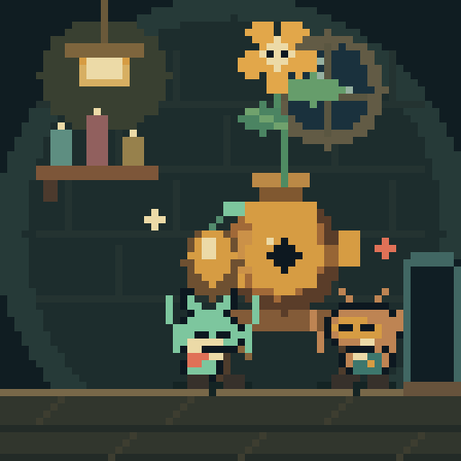

# Pixoo — Mosslight Works

Little creatures make improbable things in a 64×64 burrow workshop. Nori delivers an oversized cog, Bramble's invention grows a living flower, a biscuit thief becomes a helper, and an umbrella turns out to be a surprisingly good teacup. Their gifts and possessions stay in the world and change later stories.

[Watch the two-world showcase](docs/workshop/assets/showcase.mp4) · [Watch one world](docs/workshop/assets/single.mp4) · [Umbrella tea](docs/workshop/assets/tea.mp4) · [Preview page](docs/workshop/index.html)




## Run locally

Python 3.10 or newer on macOS/Linux; **no pip dependencies** for the workshop or normal catalog. A truecolor terminal at least 64 columns × 34 rows is needed for the terminal preview.

```sh
./pixoo run workshop
./pixoo run workshop --arg worlds=2
```

The two worlds appear side by side in a terminal at least 130 columns wide. In a narrower terminal, **Tab** switches between them. Both worlds continue running.

- **Space** queues the next suitable story.
- **1 / 2 / 3 / 4** request invention / delivery / biscuit / tea.
- **p** pauses; **r** resets the worlds; **q**, **Escape**, or **Ctrl-C** stops.

A request takes effect after the current story completes so a traveler cannot teleport or lose its gift. If an interaction needs a seed, the workshop makes one first. A ready gift is delivered before starting another requested story.

For an immediate show-and-tell moment, start directly in a prepared story:

```sh
./pixoo run workshop --arg show=tea
./pixoo run workshop --arg worlds=2 --arg show=delivery
./pixoo run workshop --arg worlds=2 --arg demo=1
```

`demo=1` shortens the quiet intervals, preserving action timing. `seed=7` is the default repeatable variation; choose another integer for a different unattended sequence.

## Run on explicitly selected Pixoos

```sh
# One world on the previously selected device, with terminal controls:
./pixoo run workshop --mirror

# One explicitly selected device:
./pixoo run workshop --ip 192.168.4.111

# Workshop first, greenhouse second. Replace both addresses with YOUR selections:
./pixoo run workshop --ip FIRST_IP --ip SECOND_IP --mirror
```

`--ip` implies device output; add `--mirror` for the terminal and controls. One or two selected devices are supported. Duplicate addresses and an ambiguous two-world device launch are rejected before discovery or writes. The order identifies the rooms; discovery does not automatically choose multiple displays.

The workshop caps brightness at **20**, respecting a lower existing setting. `--device-brightness 30` changes the cap. Live delivery defaults to **4 fps**, with a separate worker and one pending latest frame per device. A slow or disconnected device retries independently while the other world continues. This is fresh live streaming, not preloaded 12 fps playback. The logical handoff is shared; separate physical displays can differ by a network/frame interval, and an unreachable display can retain its last image until it reconnects.

**Stop with Ctrl-C** in the launching terminal (or q/Escape in mirror mode). A process running in the background can be stopped with `kill "$pid"` using the PID captured at launch; SIGTERM runs the same cleanup. Brightness and screen power are restored on a clean stop. On this firmware, setting brightness wakes the screen, so power is restored last. The custom framebuffer/channel remains selected; use your usual `./pixoo channel 0` to return to clock faces. A forced `kill -9` cannot run restoration.

For a finite demonstration:

```sh
./pixoo run workshop --ip 192.168.4.111 --duration 120
```

## Headless preview and recording

```sh
./pixoo run workshop --arg worlds=2 --snap /tmp/mosslight.png --duration 90
```

This writes the latest workshop frame to `/tmp/mosslight.png` and the greenhouse to `/tmp/mosslight-2.png`. No terminal or hardware is needed. The snapshots are nearest-neighbor 8× PNGs.

The recorded showcases contain the actual Program frames at **4 fps**, enlarged with nearest-neighbor scaling. They are local demonstrations, not camera recordings of hardware. To reproduce them, use the optional **ffmpeg** command-line encoder (the runtime itself does not need ffmpeg):

```sh
python3 tools/workshop_showcase.py --worlds 2 --seconds 96 --output /tmp/mosslight.mp4
python3 tools/workshop_showcase.py --worlds 1 --show tea --seconds 30 --output /tmp/tea.mp4
```

To view the supplied recording page in a browser:

```sh
python3 -m http.server 8765 --bind 127.0.0.1 --directory docs/workshop
# Open http://127.0.0.1:8765/ — Ctrl-C stops this local server.
```

## Verification and the existing catalog

```sh
make test
./pixoo list
./pixoo run life
python3 tools/audit_programs.py --output /tmp/pixoo-review
```

Regression checks cover the story opening, persistent outcomes, single-world and two-world delivery, rendered courier uniqueness during travel, frame purity, cadence independence, an hour of simulated unattended progression, input through a real PTY, cleanup on partial startup failure, latest-frame ownership, independent device workers, errors/recovery, periodic PicID resets, upload pacing, target selection and exact PNG pixels.

A final five-minute physical run on **192.168.4.111** acknowledged **1,163 frames** (about **3.88 fps**), recovered automatically from one timeout, and restored its original brightness and off state. **38 tests pass**; an accelerated one-hour two-world render soak completed 89 stories. See [hardware evidence and craft notes](docs/workshop/BUILD_NOTES.md). **The two-device handoff is demonstrated locally; a second physical Pixoo has not been selected for this session.**

The repository also includes 72 earlier programs and a separate NumPy Mandelbrot tour. Their findings and repair priorities are in the [project review](docs/PROJECT_REVIEW.md). This implementation addresses the shared input, lifecycle, transport, priming and snapshot issues needed by the new experience; the program-specific DLA/TSP/magnetic-pendulum repairs remain a documented follow-up.
