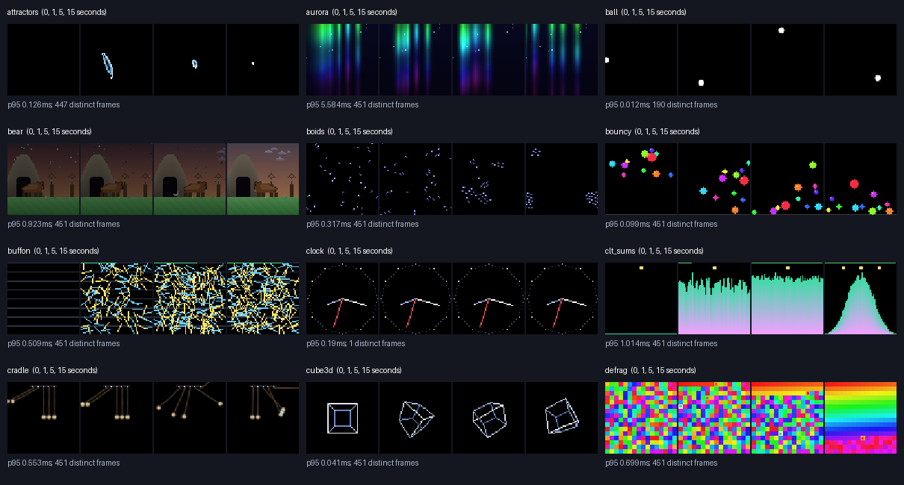
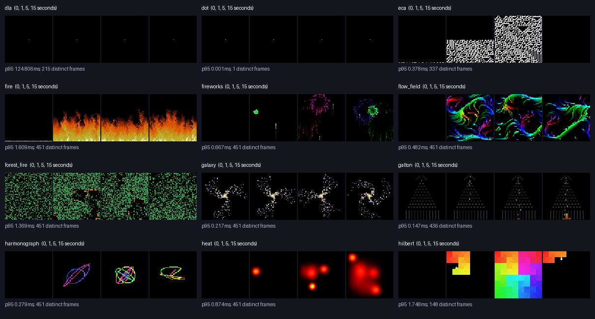
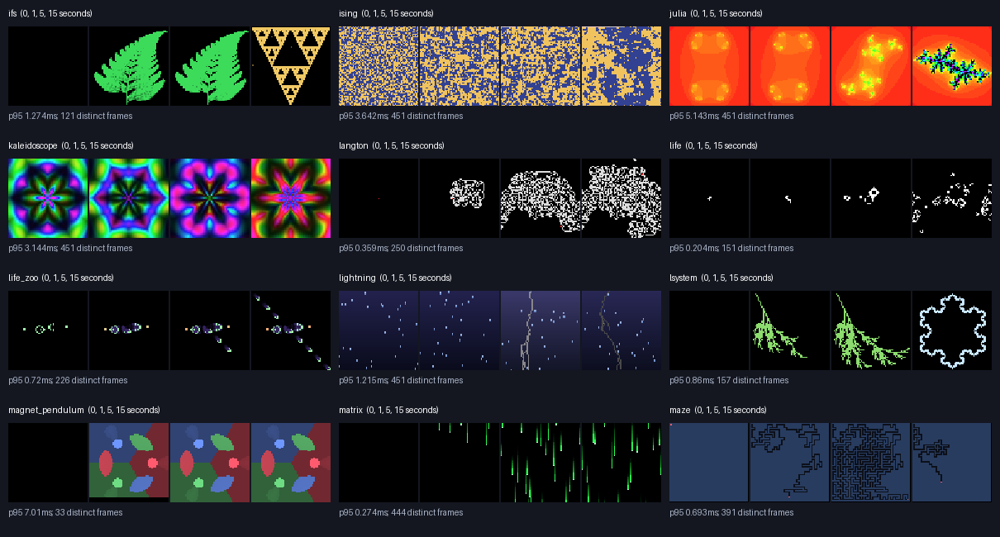
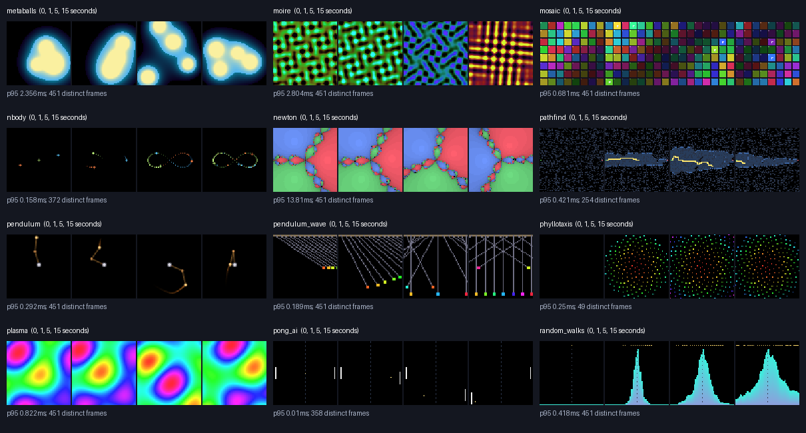
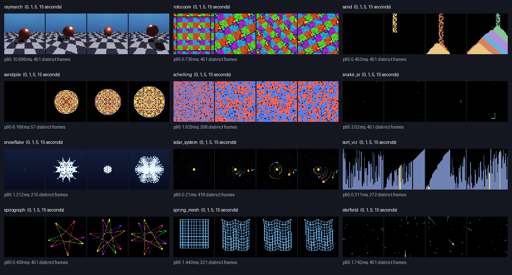
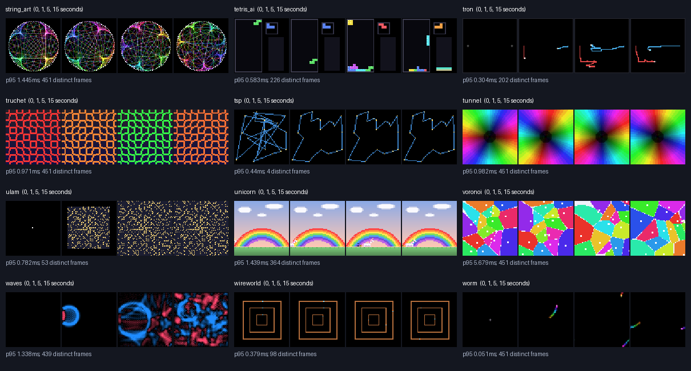
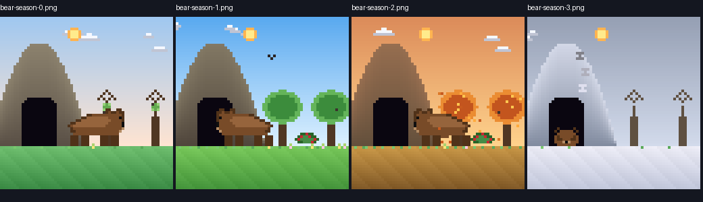

# Pixoo project review — 2026-09-05

Baseline: `fbc6935`, clean working tree before this review. Python 3.14.6 on the local Mac.

**Implementation follow-up:** [Mosslight Works](../README.md) now adds an original workshop and greenhouse, bringing the catalog to 73 programs. Shared terminal input, lifecycle cleanup, independent paced device workers, recovery, target-specific priming, finite capture and PNG expansion have been repaired. The current suite has 38 passing tests, and a five-minute single-device run verified upload recovery and settings restoration. [Evidence and limits](workshop/BUILD_NOTES.md). The DLA, TSP, magnetic-pendulum and broader catalog timing repairs below remain next work. This document preserves the original baseline findings and measurements; its line references describe that baseline.

The project is a substantial collection of working pixel programs sitting on an unfinished runtime. Preserve the catalog and the small, dependency-light Program/Frame interface. Repair input, scheduling, device recovery, and a few broken program loops before treating a new experience as finished. The proposed new experience has not been specified yet; this document prepares its implementation and the accompanying repairs.

## What exists

- **72 discoverable programs**, all importing successfully: physics, cellular automata, algorithm demonstrations, fractals, ambient effects, self-playing games, and two character scenes.
- **One separate Mandelbrot tour**, with NumPy rendering, target discovery/cache, palettes, parent-to-child zooms, and a producer thread buffering up to 40 minutes. It does not participate in `pixoo list/run`, terminal preview, snapshots, or device selection.
- **Three composable drivers:** ANSI terminal, HTTP device, PNG snapshots. Mirror mode is a list of drivers, not a separate implementation.
- **A functioning CLI:** discovery/selection, scan, identification blink, config, text, channel, brightness, clear-text, raw requests, program list/menu, `run`, `--device`, `--mirror`, `--snap`, and repeated `--arg KEY=VALUE`.
- **Five diagnostic probes**, plus Makefile process controls aimed specifically at the standalone Mandelbrot script.
- **Eight tests**, all passing: five protocol/request tests and three deterministic renderer goldens. The protocol transport seam is useful infrastructure. The tests do not exercise the terminal, runner, live driver recovery, CLI state, most renderers, or full program cycles.

The regular catalog/runtime is stdlib-only. NumPy is required by the standalone tour; there is no dependency manifest or installer. `CLAUDE.md` describes a planned Textual runtime and lazy dependency installation that do not exist. There is no README. Most catalog development is from April; the latest commits add protocol tests and renderer goldens in August.

## What I actually verified

`make test`: **8/8 pass**, with a warning about the duplicate `test` target.

The new [offline audit tool](../tools/audit_programs.py) runs setup, update, and render for every program, independently at simulated 30 fps and 5 fps. It calls render on every tick, validates the 12,288-byte RGB buffer, records timings and distinct frame hashes, and exports frames at 0, 1, 5, and 15 seconds.

**144 runs, 37,944 frame renders, zero exceptions.** Seed 12345; default program parameters; 15 simulated seconds per run. See [raw measurements](review-assets/results.json) and the complete catalog below. A passing run means it produced valid frames for that interval, not that its algorithm or long-term behavior is correct.

Additional checks:

- Real pseudo-terminal input tests for an Up Arrow, Space, and two buffered characters.
- Fake-device checks for a 170 ms frame upload, partial startup failure, 65 frame uploads, cross-device priming, and a firmware error response.
- Targeted 60-second TSP state inspection, 100 DLA updates, and 1,000 magnetic-pendulum updates.
- One **full default 72-minute Bear year** at simulated 5 fps, with periodic rendering: all four seasons; walking, eating, sleeping and hibernation; papa arrival/courtship/departure; cub emergence/activity/departure. [State trace](review-assets/bear-year.json), [season samples](review-assets/bear-year.png). This is a state-cycle check, not continuous visual playback of the full year.
- Standalone Mandelbrot imports and renders one valid RGB frame offline.
- Visual inspection of all six catalog contact sheets and Bear's four seasons.

No physical display was contacted or changed. The 4–5 fps live-upload guidance comes from this repository's measured `PROTOCOL.md`, not a new hardware measurement. Synthetic timing does not reproduce LED brightness, WiFi recovery, sustained memory use, or perceived animation smoothness. Clock deliberately reads actual wall time, so a static clock in the accelerated audit is expected; Dot deliberately stays still without input. Setup images can be blank by design.

Reproduce the catalog review:

```sh
make test
python3 tools/audit_programs.py --output /tmp/pixoo-review
# Open /tmp/pixoo-review/index.html for both cadences and all samples.
# Narrow or extend a run:
python3 tools/audit_programs.py --program magnet_pendulum --seconds 60 --fps 30 5 --output /tmp/pixoo-magnet-review
```

## Fix first: shared failures

| Finding and evidence | User impact | Concrete repair and acceptance check |
|---|---|---|
| **Arrow decoding is broken.** `term.py:73` mixes `select()` on the file descriptor with buffered `sys.stdin.read()`. Injecting `b'\x1b[A'` through a PTY returns `key='escape'`; injecting `b'ab'` returns only `a` on the first poll. Space returns `' '`, whereas Dot expects `'space'`. | Up Arrow can quit the smoke-test program. Buffered keystrokes stall. Color cycling does not work. | Read bytes with `os.read`, retain a decoder buffer across polls, parse complete and fragmented escape sequences, distinguish a lone Escape using a deadline, normalize Space. PTY tests must prove arrows move Dot without quitting, burst keys are delivered in order, fragmented sequences work, and Escape/Ctrl-C still exit. |
| **Uploads block simulation and terminal rendering.** `runtime.py:75` invokes every driver's `render()` sequentially; `device.py:33` performs synchronous HTTP. A fake 170 ms POST produces steady update intervals of 170 ms despite requesting 30 fps. | Mirror mode slows down; input waits; frame-based simulations change speed on the device. | Put device I/O behind a single worker with one replaceable latest-frame slot. Copy frame bytes before publishing because programs may reuse mutable frames. Keep simulation/render timing separate from device sampling. Prove bounded storage and responsive terminal/input under slow or failing transport. |
| **Device longevity and errors are unhandled.** `device.py` resets PicID only at startup: 65 uploads produce one reset and PicID 65. It catches and discards all upload exceptions. Default 12 fps conflicts with the measured live-upload recipe in `PROTOCOL.md`. `client.post()` returns nonzero firmware error codes without enforcing success. | A frozen/disconnected display can look like a healthy process; the documented periodic-reset mitigation is absent. | Use a default near 4 fps, serialize all session requests, perform periodic ID reset per the existing measured recipe, validate responses in typed operations/driver, expose failures and recovery status, back off/re-prime after persistent failure. Preserve raw command inspection. Fake tests cover rejection, timeout, recovery, reset order and monotonic IDs between resets; then confirm on hardware. |
| **Partial startup does not clean up.** Driver starts occur before the `try/finally` in `runtime.py:60`. With a successful first driver and a failing second driver, observed calls are only `first.start`, `second.start`. | Device startup failure in mirror mode can leave the terminal in cbreak/alternate-screen mode with a hidden cursor. | Put acquisition inside protected cleanup, track started drivers, make a partially failing driver unwind its own resources, and continue cleaning up if a stop fails. Verify terminal settings after injected failures at each stage. |
| **Priming is global and premature.** `session.py:22` checks only the cached boolean. A cache primed for device A causes zero priming requests for device B. `cli.py:288` marks primed before `Runner.run()` starts; `PixooDriver.start()` itself sends no frame. | Text can silently disappear when switching devices or after failed startup. | Scope session state to the target IP, mark primed only after a successful frame, invalidate on channel changes/failures, and handle malformed/incomplete cache state with an actionable message. Reproduce A→B, failed initial upload, channel change, and missing `ip`. |

These fixes benefit the entire catalog and the upcoming experience. Do not promise 12 fps of fresh live content: the repository's measurements support about 5 fps upload and 10–12 fps playback of already uploaded loops.

## Fix next: confirmed program failures

### DLA renders resets instead of gradual growth

At `programs/dla.py:26`, each update launches 1,800 walkers, each allowing 600 steps, before checking the 1,100-cell reset threshold. In the first 100 seeded updates, **52 end with only the center seed**. The first counts are `975, 1, 1061, 1, 1, 994, 1…`. The visible result alternates large growth with a nearly blank frame. Measured p95 is **124.8 ms**, with a **624.9 ms** maximum in the 30 fps run.

Repair: retain incremental walker state, limit work per tick, stop growth at a visible milestone, hold the completed cluster for an explicit duration, then reseed. Validate that intermediate growth appears across multiple frames, the completed cluster is held, and per-tick work is bounded. Benchmark before choosing a numeric budget; simply moving networking to a thread cannot fix this CPU stall.

### TSP's route accounting becomes negative and convergence never restarts

`programs/tsp.py:56` permits `i=0, j=N_CITIES-1`: reversal of the entire tour. The two-opt delta formula assumes distinct boundary edges, so this case incorrectly reports an improvement even though a whole-tour reversal leaves the route length unchanged. It repeatedly resets stagnation and corrupts `_cur_len`.

With seed 12345, after 60 simulated seconds the stored length is **−47,879.766**, actual recomputed length is **252.616**, stagnation is zero, and the original cities remain. The initial 15-second run has only four distinct images.

Repair: reject equivalent/degenerate moves, use an improvement tolerance, check the accumulated length against recomputation, and make completed-route hold/restart explicit. Acceptance: positive length matching the route, no false improvement from whole-route reversal, visible optimization steps, and eventual restart after convergence.

### Magnetic-pendulum map never starts a second cycle

`programs/magnet_pendulum.py:85` returns immediately when `_cycle_done` is true. That makes the hold/decrement/reseed code below unreachable after completion. After 1,000 updates the state is still `cycle_done=True, hold=60, cursor=(0,64)`.

Repair: handle the completed/hold state before returning, use elapsed seconds for the hold, and clear or deliberately transition the old field when magnets move. Verify at least two completed maps and changed magnet positions.

### Timing varies across experiences

**19 programs never read `dt`** in update: `buffon`, `dla`, `dot`, `fire`, `forest_fire`, `hilbert`, `ifs`, `langton`, `lsystem`, `maze`, `pathfind`, `phyllotaxis`, `random_walks`, `sandpile`, `schelling`, `snowflake`, `sort_viz`, `tsp`, `ulam`. Dot's movement is event-driven, but its trail still ages by frame.

Others mix real-time timers with work-per-frame or damping-per-frame: examples include `attractors`, `boids`, `clt_sums`, `defrag`, `harmonograph`, `heat`, `ising`, `sand`, `spirograph`, `spring_mesh`, and `waves`. `life_zoo`, `tetris_ai`, and `tron` discard accumulated timing remainder. `galton` caps each incoming dt at 0.1 seconds: across ten simulated seconds it actually spawns **55 beads at 30 fps versus 27 at 5 fps**, instrumenting `_spawn` across internal resets.

Repair the scheduler first, with a stable simulation cadence and bounded catch-up, then migrate programs to explicit step rates/seconds and fixed physics substeps where appropriate. Preserve the existing 30 fps appearance as an initial reference, then deliberately tune each family for a 4–5 fps display. Test state progression under different driver cadences, not just frame equality. Do not blindly multiply every probability or force by dt; establish the intended simulation step first.

## Experience quality and catalog repair plan

| Family | What is worth preserving | What to improve |
|---|---|---|
| **Character scenes: Bear, Unicorn** | Bear is the richest authored experience, with a working seasonal narrative and efficient layered drawing. Unicorn is a complete walking scene. | Correct Bear's menu description (12 min/8 days versus actual 72 min/24 days). Clarify whether `year` should also scale the fixed 180-second day and lunar schedule. Add reproducible seeds and direct seasonal/day/weather previews for QA. Visually review narrative events, not only season stills. Retain the existing art unless the new goal changes it. |
| **Physics and space** | Pendulum and cradle already have fixed substeps; nbody uses a simulation accumulator. Wireframe cube, pendulum wave, and galaxy read clearly in samples. | Bring Galton, cloth, boids and bouncing/collision systems onto consistent timing. Validate trails, collision stability and slow-output legibility; expose only useful controls. Keep orbit-speed and size compromises explicit for solar_system. |
| **Cellular/emergent systems** | Strong variety; sand, ECA, Life, snowflake and sandpile provide distinct growth behavior. | Fix DLA first. Standardize simulation rates and growth/hold/reset pacing. Validate full seed/rule cycles for Life zoo and ECA. Wireworld is currently square circuits with pulses, not the computing-gate sandbox envisioned in IDEAS. Sand is autonomous grains, not the proposed mouse-painted multi-material toy. |
| **Algorithm demonstrations** | Sorting, maze generation/solving and path expansion are recognizable; defrag's finished spectrum is clear. | Fix TSP first. Add terminal status for algorithm/rule/phase and controls for pause, reset and next. Tune completion holds and operation counts so progress is readable on the display. Existing sorting algorithms are bubble/insertion/selection/shell; backlog references to other algorithms are aspirations. |
| **Fractals and mathematical drawings** | Julia, Newton, IFS, L-systems, harmonograph, spirograph and string art all render valid distinct material. | Fix magnetic-pendulum cycling. Attractor samples become tiny during part of the sampled interval; later state again spans a large orbit, so this is a framing/trail review, not a proven permanent freeze. Normalize growth timing, preserve finished patterns briefly, and avoid needlessly recomputing unchanged completed frames. |
| **Ambient effects** | Aurora, plasma, metaballs, tunnel, moiré, Voronoi, lightning and the other effects offer useful variety without extra packages. | Review motion at real device cadence after transport repair. Add deterministic previews and curated playlists. Prefer parameter/contrast/pacing adjustments supported by visual evidence over rewriting working effects. |
| **Self-playing games** | Snake, Pong, Tetris and Tron all advance without exceptions in the short runs. | Preserve accumulator remainder for Tetris/Tron. Test game-over/restart and long-run occupancy. Snake is a BFS self-player with death/reset paths, not the never-dying board-filling algorithm imagined in IDEAS. Establish whether gameplay spectacle or algorithm fidelity is the aim before changing strategy. |
| **Clock and smoke tests** | Clock works as a wall-time display. Dot and Ball are small diagnostic programs. | Repair Dot input and promote it to an actual PTY smoke test. Inject a clock for deterministic clock checks. Label diagnostic programs clearly in the picker. |

## Remaining product/runtime gaps

- **Discovery and launch:** an alphabetized 72-item menu has no categories, search, favorites, preview, or per-program help. Import failures are silently hidden. The existing `--arg` mechanism works, but params are untyped, unknown keys are silently accepted, and invalid values can traceback. `--fps 0` currently raises `ZeroDivisionError`. There is no random selection, playlist, program switcher, or general `pixoo stop`.
- **Terminal:** no control hints, program/phase status, pause/reset/next, mouse event parser, or small-terminal handling. The renderer assumes a 64-column/32-row image and appends a newline after the final row, so viewport sizing needs explicit testing. A full Textual migration is not required to fix input and add basic status.
- **Snapshots:** atomic latest-PNG writes are useful, but the default 512×512 PNG generation is synchronous Python pixel expansion. One local black-frame write took **28.85 ms**, almost the entire 30 fps frame budget. Consider cheaper row expansion, a worker using copied frame bytes, and explicit lower-resolution capture options. Add finite `--frames`/`--duration` capture for review instead of requiring background processes.
- **Mandelbrot:** preserve its rendering/tour work but expose it through the common selection, preview and lifecycle model. Keep its precomputation needs explicit rather than forcing expensive rendering into the interactive tick. It and the Makefile hardcode an IP, bypass the client/session seam, and have separate process control. The pipeline catches generator exhaustion but does not propagate renderer exceptions to the consumer as a structured failure; normal exhaustion can also wait for the 30-second empty-queue timeout. Add completion/error signaling and validate cache contents.
- **Documentation:** update `CLAUDE.md` to describe the actual API (`setup()` takes no ctx), stdlib drivers, supported flags, measured upload ceiling and auto-discovery. Mark snapshot/arg support as shipped in TODO; separate incomplete ideas from shipped capabilities. Add a README with terminal-first quickstart and explicit NumPy setup for the tour. Remove the duplicate Makefile test recipe. Keep existing fast-path command shapes.

## Implementation order for the proposed goal

1. **Define the new experience's observable behavior** from the forthcoming goal: autonomous/interactive, scene/state progression, intended cadence, controls/parameters and completion criteria. Build it against Program/Frame and add deterministic offline previews early.
2. **Repair the common input and lifecycle path** so the experience can be exercised reliably in terminal and mirror modes. Add focused PTY and cleanup tests around the reproduced failures.
3. **Repair scheduling and device transport**, including latest-frame ownership, rate limiting, PicID maintenance, errors/recovery, and target-specific priming. Validate slow/erroring transport with the existing injectable seam, then exercise the actual device.
4. **Fix DLA, TSP and magnetic-pendulum**, with bounded-work, route-invariant and multi-cycle checks. Migrate timing-sensitive existing programs by family while preserving reviewed visual references. Change goldens only for reviewed intentional visual changes.
5. **Finish the new experience and its device acceptance** alongside the relevant existing family: launch, controls, all meaningful states, full cycle/restart, input responsiveness, readable 4–5 fps output, and failure/recovery behavior.
6. **Improve selection and operations**: per-program descriptions/parameter help, pause/reset/next, finite capture, then playlist/random/stop and Mandelbrot integration. Select the amount needed for the new experience; do not make an extensive new UI a prerequisite for basic runtime fixes.

No new experience or production repair has been implemented in this review. The added artifacts are the audit tool, reproducible measurements, visual samples, and this plan. The proposed goal determines the next implementation scope.

## Complete catalog: 30 fps measurements and disposition

All entries also passed the 5 fps run. p95 measures update plus render only; it excludes terminal, network and PNG writing. “Baseline” means no program-specific fault established in this short review; shared runtime repairs and later cycle/device checks still apply. Performance numbers are local observations, not portable guarantees.

| Program | p95 ms | Review disposition |
|---|---:|---|
| [attractors](../programs/attractors.py) | 0.13 | Review transient tiny framing/trail; fixed work per frame. |
| [aurora](../programs/aurora.py) | 5.58 | Baseline; verify full cycle and physical-display pacing. |
| [ball](../programs/ball.py) | 0.01 | Baseline; verify full cycle and physical-display pacing. |
| [bear](../programs/bear.py) | 0.92 | Full year state cycle passed; fix description and time-scale contract. |
| [boids](../programs/boids.py) | 0.32 | Steering applied per update; normalize physics cadence. |
| [bouncy](../programs/bouncy.py) | 0.10 | Validate collision stability and re-energizing at slow cadence. |
| [buffon](../programs/buffon.py) | 0.51 | Frame-based sampling; make convergence signal legible. |
| [clock](../programs/clock.py) | 0.19 | Wall-clock based; inject time for repeatable verification. |
| [clt_sums](../programs/clt_sums.py) | 1.01 | Sampling per frame mixed with seconds per phase. |
| [cradle](../programs/cradle.py) | 0.55 | Existing fixed substeps; preserve and verify impulses/cycles. |
| [cube3d](../programs/cube3d.py) | 0.04 | Baseline; verify full cycle and physical-display pacing. |
| [defrag](../programs/defrag.py) | 0.70 | Sorting work per frame, hold in seconds. |
| [dla](../programs/dla.py) | 124.81 | Confirmed early-reset visual failure and CPU outlier. |
| [dot](../programs/dot.py) | 0.00 | Confirmed broken arrow/space input; frame-aged trail. |
| [eca](../programs/eca.py) | 0.38 | Verify all rule transitions and elapsed-time remainder. |
| [fire](../programs/fire.py) | 1.61 | Simulation work per frame. |
| [fireworks](../programs/fireworks.py) | 0.67 | Rendering writes trail buffer; preserve frame ownership/order. |
| [flow_field](../programs/flow_field.py) | 0.48 | Review trail fade versus cadence. |
| [forest_fire](../programs/forest_fire.py) | 1.37 | Frame-based generation and event probabilities. |
| [galaxy](../programs/galaxy.py) | 0.22 | Baseline; verify full cycle and physical-display pacing. |
| [galton](../programs/galton.py) | 0.15 | Confirmed 55 vs 27 spawns/10s at 30 vs 5 fps. |
| [harmonograph](../programs/harmonograph.py) | 0.28 | Trace steps per frame mixed with seconds per phase. |
| [heat](../programs/heat.py) | 0.87 | Diffusion steps per frame, source timing in seconds. |
| [hilbert](../programs/hilbert.py) | 1.75 | Frame-based growth/hold; existing golden coverage. |
| [ifs](../programs/ifs.py) | 1.27 | Frame-based growth/hold. |
| [ising](../programs/ising.py) | 3.64 | Monte Carlo steps per frame, cooling in seconds. |
| [julia](../programs/julia.py) | 5.14 | Baseline; verify full cycle and physical-display pacing. |
| [kaleidoscope](../programs/kaleidoscope.py) | 3.14 | Baseline; verify full cycle and physical-display pacing. |
| [langton](../programs/langton.py) | 0.36 | Frame-based steps; existing golden coverage. |
| [life](../programs/life.py) | 0.20 | Validate every seed and stasis/oscillation restart. |
| [life_zoo](../programs/life_zoo.py) | 0.72 | Retain tick remainder; verify six-pattern cycle. |
| [lightning](../programs/lightning.py) | 1.22 | Baseline; verify full cycle and physical-display pacing. |
| [lsystem](../programs/lsystem.py) | 0.86 | Frame-based growth/hold; verify all four presets. |
| [magnet_pendulum](../programs/magnet_pendulum.py) | 7.01 | Confirmed permanent hold after first map. |
| [matrix](../programs/matrix.py) | 0.27 | Review fade quantization at different cadences. |
| [maze](../programs/maze.py) | 0.69 | Frame-based generation/solve/hold. |
| [metaballs](../programs/metaballs.py) | 2.36 | Baseline; verify full cycle and physical-display pacing. |
| [moire](../programs/moire.py) | 2.80 | Baseline; verify full cycle and physical-display pacing. |
| [mosaic](../programs/mosaic.py) | 0.68 | Baseline; verify full cycle and physical-display pacing. |
| [nbody](../programs/nbody.py) | 0.16 | Existing fixed-step accumulator; bound catch-up and review trails. |
| [newton](../programs/newton.py) | 13.81 | 13.81 ms p95; avoid adding synchronous I/O overhead. |
| [pathfind](../programs/pathfind.py) | 0.42 | Frame-based search/path/hold; bounded map generation desirable. |
| [pendulum](../programs/pendulum.py) | 0.29 | Existing fixed substeps; verify resets and n parameter. |
| [pendulum_wave](../programs/pendulum_wave.py) | 0.19 | Baseline; verify full cycle and physical-display pacing. |
| [phyllotaxis](../programs/phyllotaxis.py) | 0.25 | Frame-based growth/hold. |
| [plasma](../programs/plasma.py) | 0.82 | Baseline; verify full cycle and physical-display pacing. |
| [pong_ai](../programs/pong_ai.py) | 0.01 | Review collisions during delayed ticks; keep rally legible. |
| [random_walks](../programs/random_walks.py) | 0.42 | Frame-based sampling/reset. |
| [raymarch](../programs/raymarch.py) | 10.70 | 10.70 ms p95; separate render from device waits. |
| [rotozoom](../programs/rotozoom.py) | 0.74 | Baseline; verify full cycle and physical-display pacing. |
| [sand](../programs/sand.py) | 0.45 | Frame-based physics/spawn; currently autonomous sand only. |
| [sandpile](../programs/sandpile.py) | 6.17 | Frame-based drops; existing golden coverage. |
| [schelling](../programs/schelling.py) | 1.93 | Frame-based moves/reset; show settled arrangement. |
| [snake_ai](../programs/snake_ai.py) | 2.02 | BFS can die/reset; long-run and pacing checks needed. |
| [snowflake](../programs/snowflake.py) | 1.21 | Frame-based growth/hold. |
| [solar_system](../programs/solar_system.py) | 0.21 | Document visual scaling; verify low-rate motion. |
| [sort_viz](../programs/sort_viz.py) | 0.31 | Frame-based comparisons/hold; add current algorithm status. |
| [spirograph](../programs/spirograph.py) | 0.44 | Trace steps per frame mixed with seconds per phase. |
| [spring_mesh](../programs/spring_mesh.py) | 1.44 | Variable-step Verlet and per-frame damping; fixed substeps. |
| [starfield](../programs/starfield.py) | 1.74 | Review trails and speed at device cadence. |
| [string_art](../programs/string_art.py) | 1.45 | Baseline; verify full cycle and physical-display pacing. |
| [tetris_ai](../programs/tetris_ai.py) | 0.58 | Preserve accumulator remainder; verify game-over/restart. |
| [tron](../programs/tron.py) | 0.30 | Preserve accumulator remainder; verify rounds/collision states. |
| [truchet](../programs/truchet.py) | 0.97 | Baseline; verify full cycle and physical-display pacing. |
| [tsp](../programs/tsp.py) | 0.44 | Confirmed invalid delta, negative length, missed restart. |
| [tunnel](../programs/tunnel.py) | 0.98 | Baseline; verify full cycle and physical-display pacing. |
| [ulam](../programs/ulam.py) | 0.78 | Frame-based growth/hold. |
| [unicorn](../programs/unicorn.py) | 1.44 | Working scene; add deterministic full-crossing preview. |
| [voronoi](../programs/voronoi.py) | 5.68 | Baseline; verify full cycle and physical-display pacing. |
| [waves](../programs/waves.py) | 1.34 | Equation steps per frame, source timing in seconds. |
| [wireworld](../programs/wireworld.py) | 0.38 | Verify pulses across periodic reinjection; current square circuits. |
| [worm](../programs/worm.py) | 0.05 | Baseline; verify full cycle and physical-display pacing. |

## Visual catalog

Each program shows 0, 1, 5, and 15 simulated seconds at 30 fps. The regenerated HTML gallery also contains the corresponding 5 fps samples.













Bear across the four seasons, sampled during the full-year state run:


